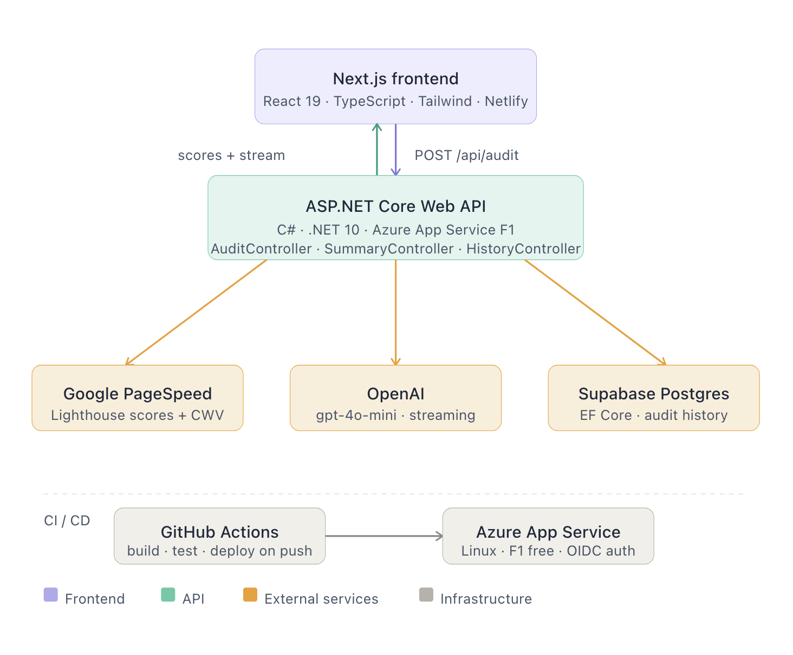

# Site Analyser

A full-stack website audit tool. Paste a URL, get real Google Lighthouse scores
(performance, accessibility, best practices, SEO) plus Core Web Vitals, and a
plain-English summary of what to fix that is streamed live from an AI model. Audit history
is persisted to Postgres and charted as a trend over time.

Built as a **React + ASP.NET Core** application: a Next.js front end talking to a
C# REST API that integrates the Google PageSpeed Insights and OpenAI APIs, with
audit history persisted to Postgres via Entity Framework Core.

> **Status:** Fully deployed. Audit pipeline, AI summary streaming, persistence, history
> chart, Playwright tests, and CI/CD via GitHub Actions all complete and working end to end.

---

## Architecture



The front end and API are two independent processes that share nothing but a
JSON-over-HTTP contract. So they can be developed, deployed, and scaled separately.

---

## Tech stack

**Frontend** — React 19, Next.js 16 (App Router), TypeScript, Tailwind CSS, shadcn/ui (Base UI), Recharts

**Backend** — C# / .NET 10, ASP.NET Core Web API, dependency-injected services

**Integrations** — Google PageSpeed Insights API, OpenAI API (streaming chat completions)

**Persistence** — Entity Framework Core 10, PostgreSQL (Supabase), Npgsql

**Testing** — Playwright (E2E audit flow, API smoke tests)

**Deployment** — Azure App Service (Linux, F1 free tier), Netlify, GitHub Actions CI/CD

**Tooling** — npm, NuGet, dotnet user-secrets for local configuration

---

## How it works

1. The user submits a URL in the React UI. The frontend POSTs it to the .NET API
   at `/api/audit`.
2. `AuditController` validates the URL and delegates to `PageSpeedService`, which
   calls Google PageSpeed Insights via `HttpClient`, then shapes the large raw
   response down to just the scores and Core Web Vitals the UI needs.
3. The clean result is saved to Postgres via EF Core and returned as JSON, rendered
   as score cards and a Core Web Vitals row in the UI.
4. Once results render, the frontend makes a second request to `/api/summary`.
   `SummaryController` hands the scores and vitals to `OpenAiService` and streams
   the model's response back token by token, writing directly to the response body
   and flushing per token so the summary types into the UI live.
5. `HistoryController` serves previous audits for a URL so the frontend can render
   a Recharts trend chart of scores over time.

A deliberate design choice: all the data-shaping and third-party integration lives
in the API layer, so the frontend receives clean, typed data rather than raw
third-party responses.

---

## Running locally

You'll need: Node 20+, the .NET 10 SDK, a Google PageSpeed API key, an OpenAI
API key (with prepaid credit), and a Supabase Postgres project.

### Backend (`api/`)

```bash
cd api
dotnet user-secrets set "PageSpeed:ApiKey" "YOUR_PAGESPEED_KEY"
dotnet user-secrets set "OpenAi:ApiKey" "YOUR_OPENAI_KEY"
dotnet user-secrets set "ConnectionStrings:Default" "Host=...;Port=5432;Database=postgres;Username=postgres;Password=...;SSL Mode=Require;Trust Server Certificate=true"
dotnet run
```

The API starts on `http://localhost:5188` (check the console output for the exact
port). Visit the OpenAPI page printed on startup to see the available endpoints.

> User secrets are stored outside the repo in your OS profile — nothing sensitive
> is ever committed.

### Frontend (`web/`)

```bash
cd web
cp .env.example .env.local
# set NEXT_PUBLIC_API_URL=http://localhost:5188
npm install
npm run dev
```

The app runs on `http://localhost:3000`. Paste a URL and run an audit.

> Run both in separate terminals. CORS is configured on the API to allow the
> frontend origin.

### Running tests

```bash
cd web
npx playwright test --project=chromium
```

Tests run against the live deployed site by default. To run against a local dev server:

```bash
BASE_URL=http://localhost:3000 npx playwright test --project=chromium
```

---

## API endpoints

| Method | Route            | Purpose                                                   |
|--------|------------------|-----------------------------------------------------------|
| POST   | `/api/audit`     | Run a Lighthouse audit for a URL; saves to DB; returns scores + vitals |
| POST   | `/api/summary`   | Stream a plain-English AI summary of an audit result      |
| GET    | `/api/history`   | Return the last 20 audits for a URL (for trend chart)     |

---

## Project structure

```
siteanalyser/
├── web/                        # React / Next.js frontend
│   ├── src/
│   │   ├── app/page.tsx
│   │   └── components/
│   │       ├── AuditResults.tsx
│   │       ├── CoreWebVitals.tsx
│   │       ├── HistoryChart.tsx
│   │       └── SiteHeader.tsx
│   └── tests/
│       ├── audit.spec.ts       # E2E audit flow tests
│       └── api.spec.ts         # API smoke tests
├── api/                        # ASP.NET Core backend
│   ├── Controllers/
│   │   ├── AuditController.cs
│   │   ├── SummaryController.cs
│   │   └── HistoryController.cs
│   ├── Services/
│   │   ├── PageSpeedService.cs
│   │   └── OpenAiService.cs
│   ├── Models/
│   │   ├── Audit.cs
│   │   └── AuditModels.cs
│   ├── Data/
│   │   └── AppDbContext.cs
│   ├── Migrations/
│   └── Program.cs
└── .github/
    └── workflows/
        ├── playwright.yml              # Playwright tests — runs on every push
        └── main_siteanalyser-api.yml   # Azure deploy — runs after tests pass
```

---

## Deployment

The API is deployed to **Azure App Service** (Linux, F1 free tier) via GitHub Actions.
The frontend is deployed to **Netlify**. Both deployments trigger automatically on
push to `main`.

The GitHub Actions workflow builds the .NET project from the `api/` monorepo subfolder,
publishes as a self-contained binary (bundling the .NET 10 runtime), and deploys to
Azure using OIDC federated credentials.

The Azure deploy workflow is gated behind the Playwright workflow: tests run first on
every push, and the backend only deploys if they pass. This means broken code cannot
reach production.

Production secrets (connection string, API keys) are configured as Azure App Settings
and are never committed to the repository.

---

## Roadmap

- [x] Full audit pipeline (PageSpeed → clean JSON → rendered UI)
- [x] Streaming AI summary
- [x] Core Web Vitals surfaced
- [x] Persist each audit to Postgres (EF Core)
- [x] `/api/history` endpoint + Recharts trend chart
- [x] Deploy API to Azure App Service via GitHub Actions CI/CD
- [x] Deploy frontend to Netlify
- [x] Playwright E2E and API tests with CI gating

---

## Notes

This started life as a Next.js-only app and was deliberately re-architected to put
the entire backend in C# / ASP.NET Core. The frontend and API live as siblings in a
monorepo (`web/` and `api/`), deployed independently to Netlify and Azure respectively.
Write-up of the build, including the deployment story, is in the blog post [BLOG.md](BLOG.md).